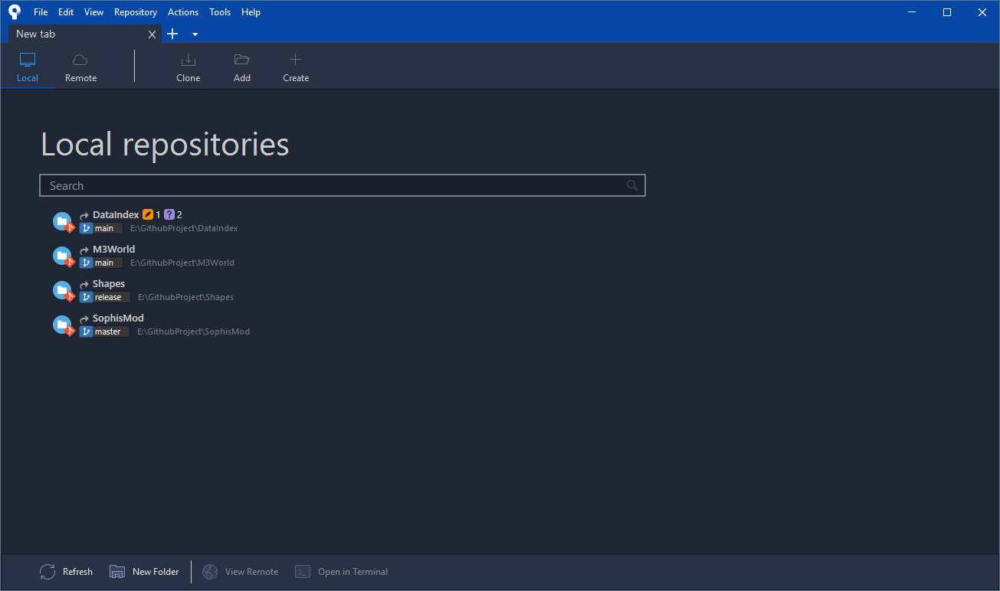
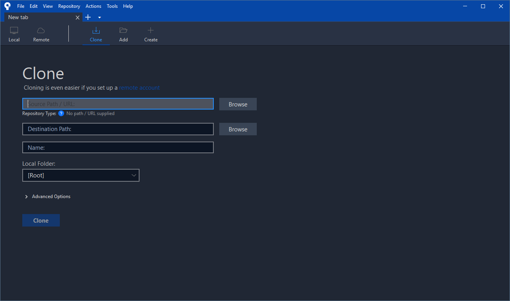
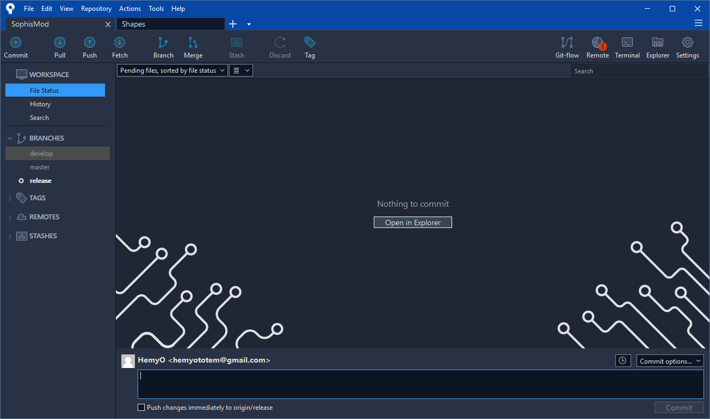
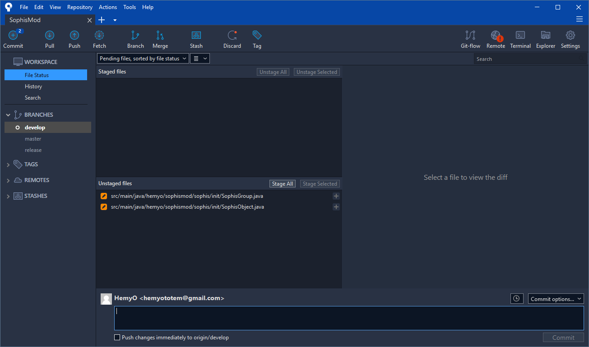
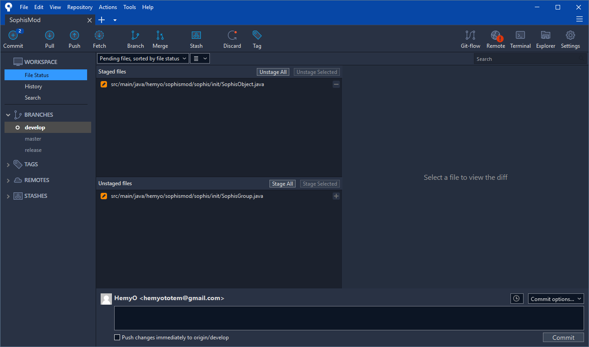
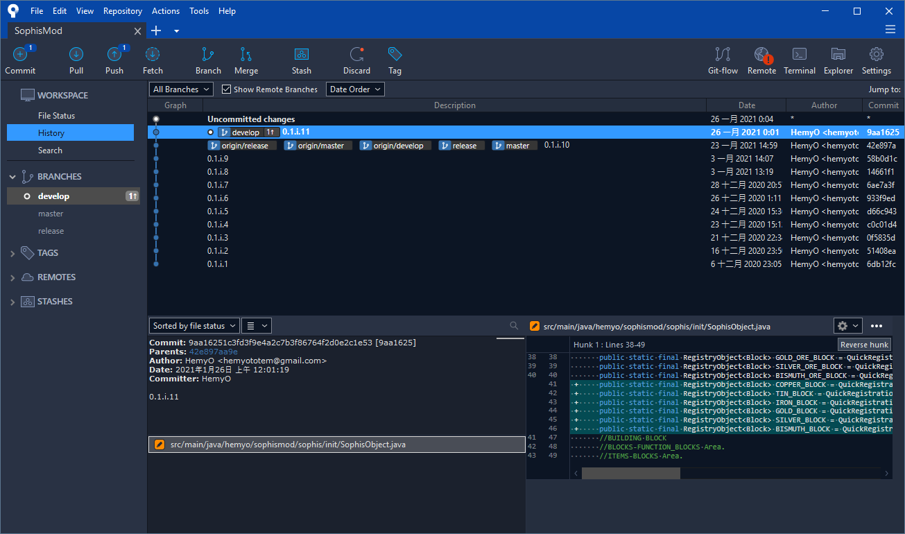
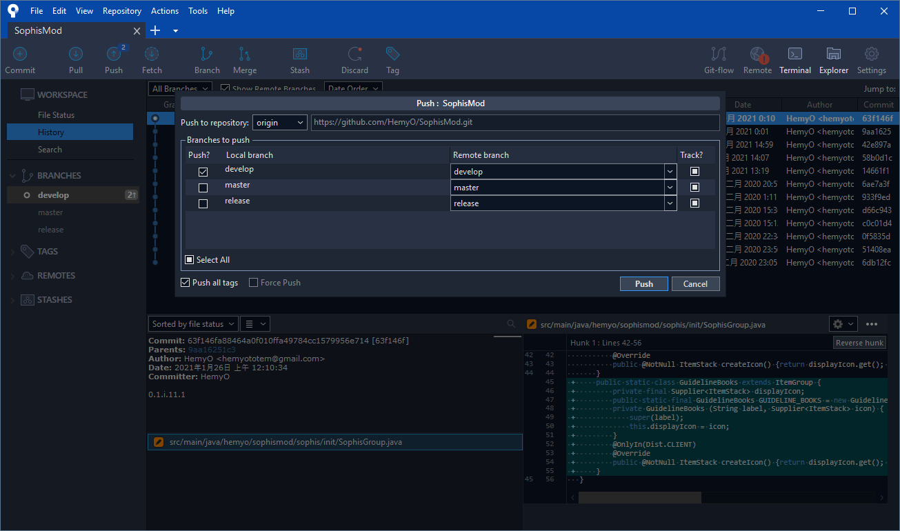
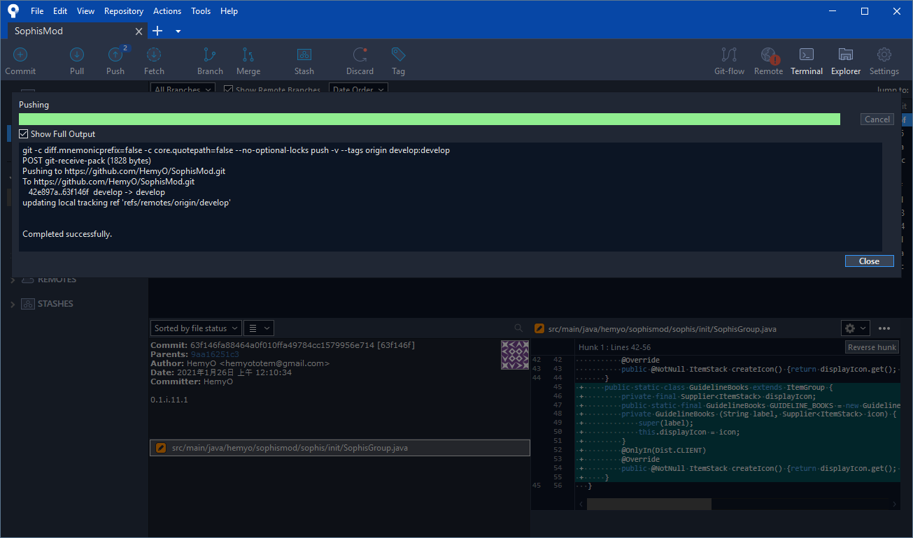
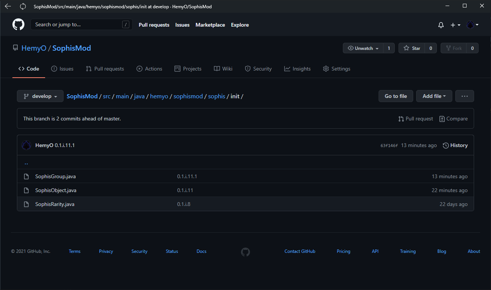
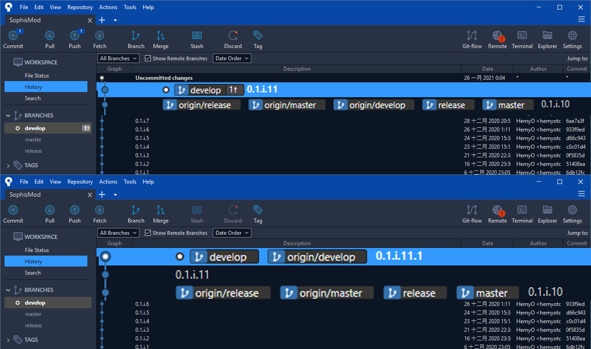

# Git的基礎運作
這裡介紹關於Git的基礎操作原理，以及遇到最基礎的衝突時之解決辦法。  
**粗體藍字** 將會顯示 SourceTree 的操作按鈕或欄位。  
***斜體紫字*** 將會顯示 git 的命令。  
**粗體紅字** 將會顯示特有名詞。  

---
  
## 一個Git專案的運作方式
先上圖：
  
箭頭中間的字代表著git的命令，而方框和圓柱體代表著資料儲存的區塊。
我們將會依照通常git的使用流程來一一介紹。  
  
### 專案的創建流程
通常，我們會在遠端伺服器創建 **Repo**(Repository的簡稱，儲存庫) ，
遠端伺服器可以自己創建，但我們通常會選擇使用提供遠端伺服器服務的平台，GitHub就是後者。  
而一個包含Git與Github的專案創建以以下方法為主：  
* L(Local略縮，本地端)
* R(Remote略縮，伺服端、遠端)
1. 在 S 創建 **Repo** 。
2. 在 L 的檔案總管內開一個空資料夾。
3. 透過命令或GUI操作將 R-**Repo** ***clone***(複製) 到空資料夾中。  
  
上述步驟是常見的 ***clone*** 創建方式，
雖然也可以透過 ***init***(初始化) 的方式來做創建，不過和本次專案的創建方法無關，故先不做討論。
  
### 專案創建方式
而剛剛說的流程就是途中 ***clone*** 的箭頭：透過已存在的 R-**Repo** ***clone*** 到 L-**Repo** 中。
而這個步驟在 SourceTree 的操作如下：  
1. 開啟 SourceTree 後，點上方列表的 **Clone** 。  
   
2. 將得到的 .git(專案的主體) URL貼到 **SourcePath/URL** 欄位，
   並在檔案總管開一個新且空的資料夾，並將檔案夾的路徑位置貼到 **Destination Path** 欄位。
   其他相關的 Name Local Folder 會自動設定，請維持預設並按下 **Clone** 。
   
3. **Clone** 完後，會出現該專案的畫面，預設只會有 **master**(正式) **branch**(分支)。
   因為目前還沒有資料異動，所以只會顯示 Nothing to commit 。
   
  
至此，一個專案就創建完成了。  
  
**Workspace** 是你的工作區，可以查看 **File Status**(檔案狀態) 、 **History** (時間線) 、 **Search** (時間線搜尋)。
而其功能也是自如其名，依序是：在檔案出現異動時會顯示相關資訊、觀察專案的時間線、查詢指定的時間線。  
而 **Branches** 則是分支切換，可以透過雙擊來切換不同的 **branch** 。  
  
而剩下的 **Tags**(標籤) 、 **Remotes**(遠端) 、 **Stashes**(暫存) 則在後續陸續說明。  
  
---
  
## Commit 、 Push 、 Origin ，基礎的Git專案操作
* 這裡使用我的專案作為範例！  
  
專案創建完成後，就可以開始專案開發了!  
  
### Stage(暫存區) 與 Commit(提交)
當我們在專案內新增資料時， SourceTree 的 **File Status** 會變成下圖：
  
畫面會分割成 **Staged File**(暫存區的檔案) 和 **Unstaged File**(非暫存區的檔案) 兩大塊。
而這時我們可以透過檔案右邊的 **+** 號來將檔案放到暫存區內，
又或者是按下 **Stage All** 全部加到暫存區中。  
而這個動作就是下圖中的 ***add***(增加) 。  
如果想要反向操作，一樣的道理，按下 **-** 號來取消選取，
又或者是按下 **Unstage All** 來全部返回。  
而這個動作是 ***add*** 的相反── ***reset***(重設)。
  
  
這裡我們先加入一個叫做"SophisObject"的資料，這時SophisObject已經在 **Staged File** 內了，
我們可以透過下方的 **Commit** 區塊來做 ***commit***(提交)動作。
  
這裡需要在欄位中填寫 ***commit*** 時要說明的事項，是必須填寫的，通常這個部分會以簡單扼要為基準。  
在填寫完之後，按下 **Commit** 按鈕來完成 ***commit*** 。  
  
完成後，可以在 **History** 查看 L- **Repo** 的時間線。  
  
  
而原本尚未 ***add*** 到的檔案則會繼續保留在 **Unstaged File** 。  
  
至此，我們已經在 L- **Repo** 控管到了變異檔案，接下來，我們要將他推到 R- **Repo** 和遠端同步。  
  
### Push(推送)
或許你已經注意到了！在完成 ***commit*** 後，上方列表的 **Push** 出現了一個 1 的圓圈。
這表示 L- **Repo** 中有1個歷程(時間線)沒有和 R- **Repo** 出現了 1 個時間線的落差。
這時我們就要將 L 的 ***push***(推送) 到 R 的。  
  
首先，我們先按下 **Push** 按鈕，準備 ***push*** 到 R 。  
這時會顯示需要 ***push*** 的  **branch** ，預設會直接打勾。
  
按下 **Push** 按鈕後，就會開始 ***push*** ，靜待幾秒後即可。  
如果有將 **Show Full Output** 打勾時，就可以看到實際操作的狀態是怎樣。
  
完成後，視窗會跳開(如果開啟了 **Show Full Output** ，就等到他的跑條變色後關閉即可)恭喜你，你已經完成了 ***push*** 動作。  
  
這時，可以前往 GitHub去查看剛剛  ***push***  的結果，如下圖所示。  
  
我們剛剛新增的資料已經在 R- **Repo** 中了！
  
### Origin(追蹤分支)
眼尖的人可能發現了， ***push*** 前後的 **History** 有些許不太一樣：
  
\(0.1.i.11這個提交因為是分批提交，所以第二次的提交後綴.2\)  
  
***push*** 前只有 develop **branch** ，而後則多了一個 origin/develop **branch**。  
**Origin** 的  **branch** ，其運作原理是：
在進行 ***push*** 時，
會將 L- **Repo** 的 **branch**  ***merge***(合併)到 **Origin** 中，
再將這個 **branch** 上傳並更新 R- **Repo** 。  
  
而理解 **Origin** 可以更方便在下一章節了解 **Conflict**(衝突) 和後續關於 **Branch**
的相關操作。  
  
---  
[下一章節(尚未完成)](GIT-基礎運作.md)  
[回目錄](README.md)  