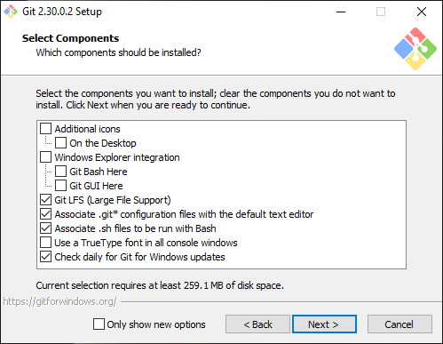
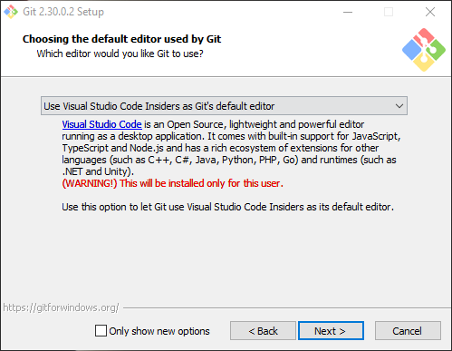
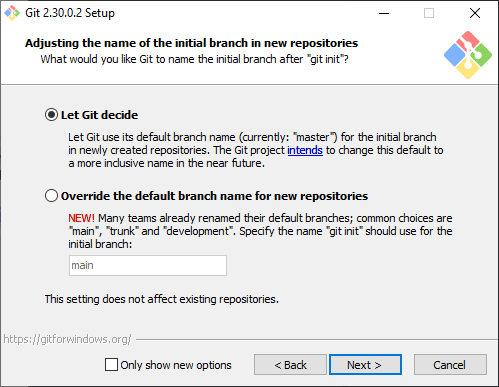
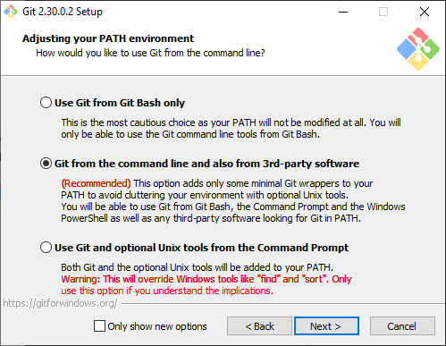
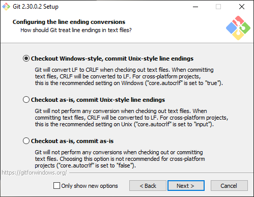

# Git與Github的起始流程  
這裡介紹關於Git與Github的前置軟體安裝教學。  

---
  
## Git for Windows
1. 請先到[Git for Windows](https://gitforwindows.org/)下載程序。  
2. 安裝程序請都依照他預設的設定做安裝，除了後面幾個。
3. Select Components
>   
> Windows Explorer Integration是整合工具，但這個軟體提供的還蠻陽春的，
> 請自行選擇要不要安裝，剩下的請維持預設。  
  
4. Choosing the default editor  used by Git
>   
> Git的預設編輯器是Vim，但在安裝流程上會以電腦上有的編輯器優先選擇。
> 而本專案以[VSCode](https://code.visualstudio.com/) / [VSCode Insider](https://code.visualstudio.com/) / [VSCodium](https://vscodium.com/) 這三個為主。
> 請自行選擇下載，後續主要以VSCode Insider為主要範本。
  
5. Adjusting the name of the initial branch in new repositories
>   
> Git的Repo有分支設計，而這裡會決定預設分支所使用的名稱，請維持預設，使用"master"。  
  
6. Adjusting your PATH environment
>   
> 這裡會決定要用哪種Shell Language為基準，請使用推薦的第二項。我們會使用 CommandShell和第三方軟體來做輔助。  
  
7. Configuring the line coding conversions
>    
> 這裡選擇第一項的預設，在Windows環境下時，使用CRLF，而提交後Git將自動轉換成Unix通用的LF。

8. 之後請直接按Next和Install吧!  
9. 安裝完成時，可以選擇將Release Note關掉。  

---

## SourceTree
1. 請先到[SourceTree](https://www.sourcetreeapp.com/)下載，SourceTree是個功能不比Git GUI低落但介面卻非常優秀的強大軟體。
2. 請按照預設進行安裝。
  
---
[回目錄](README.md)