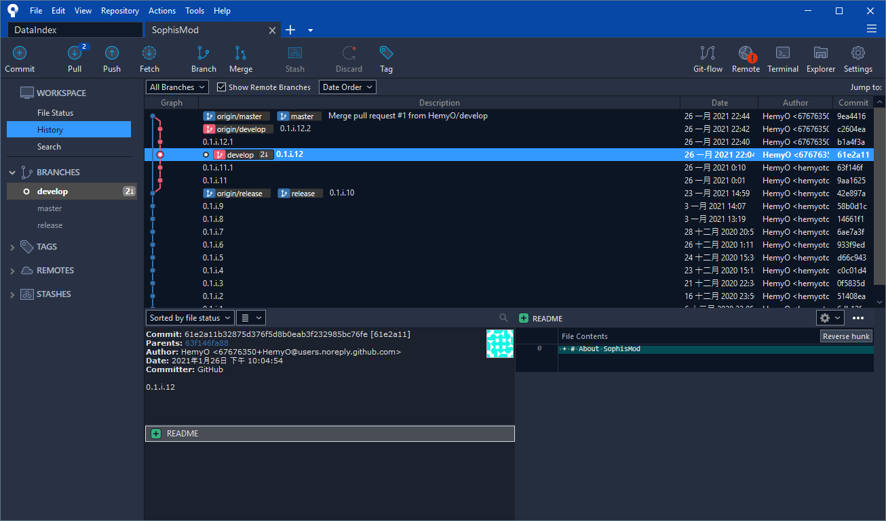
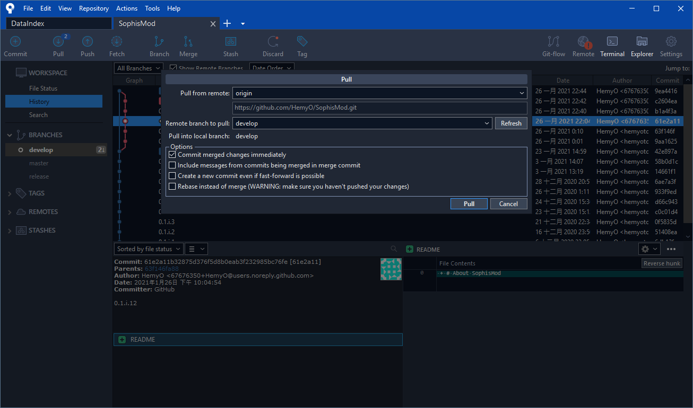
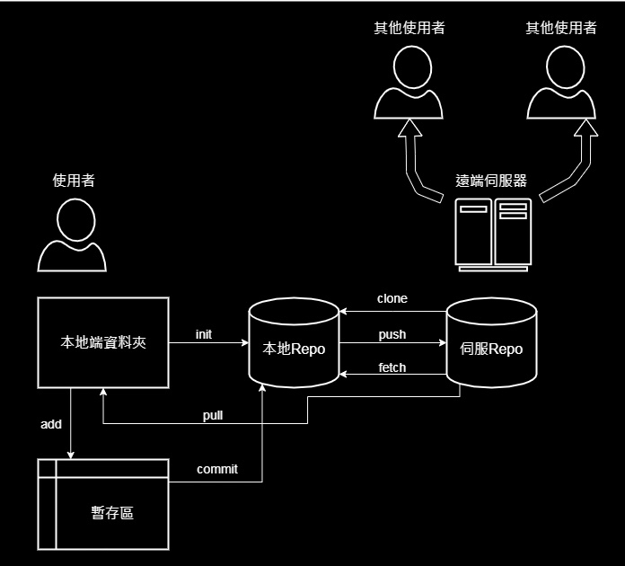
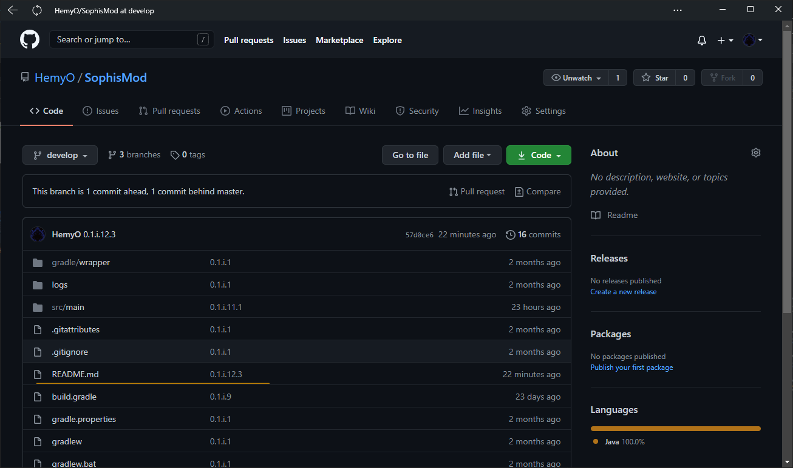
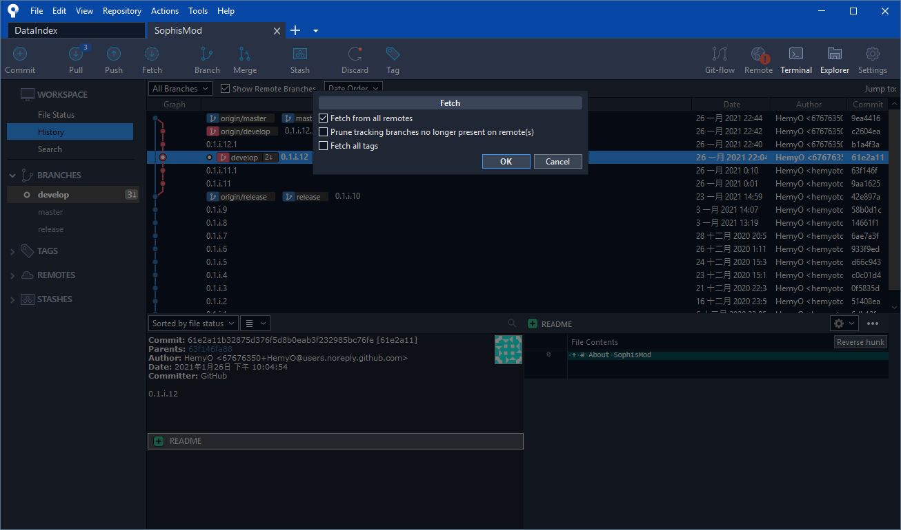
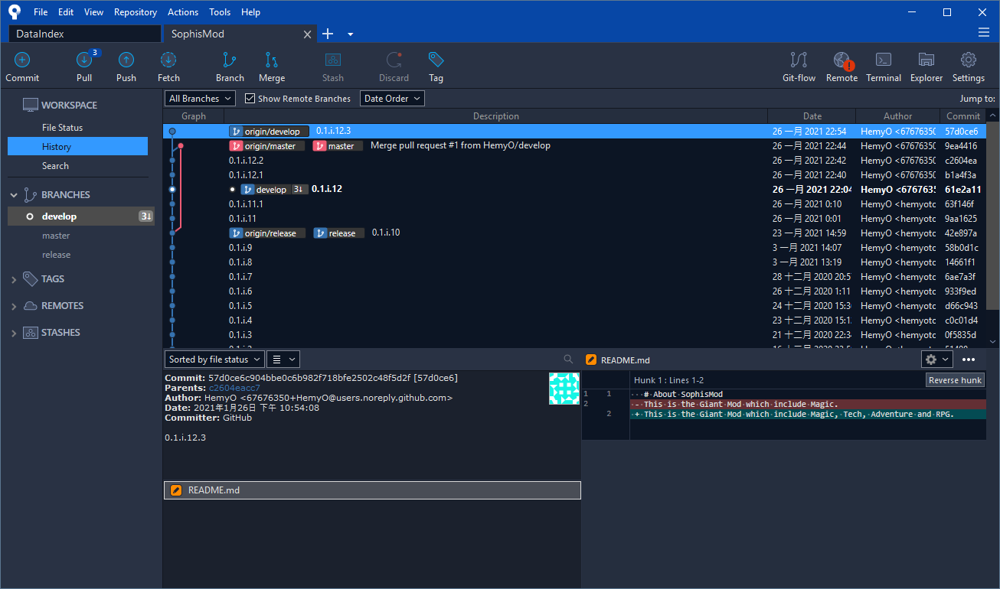
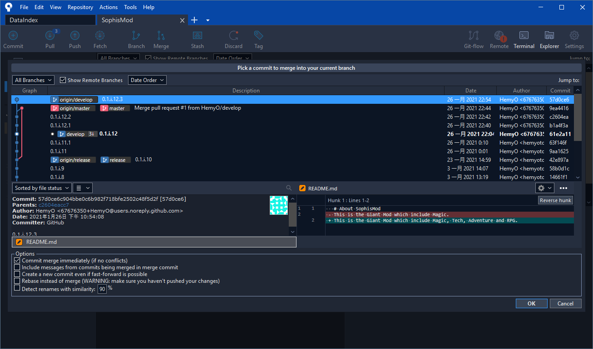
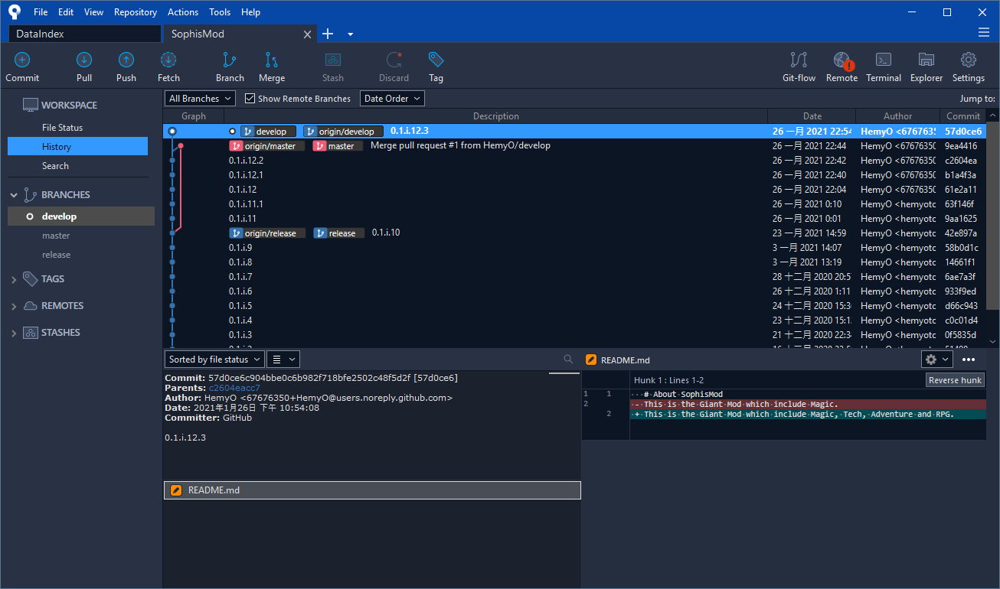
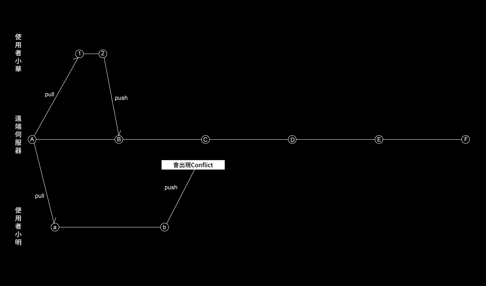
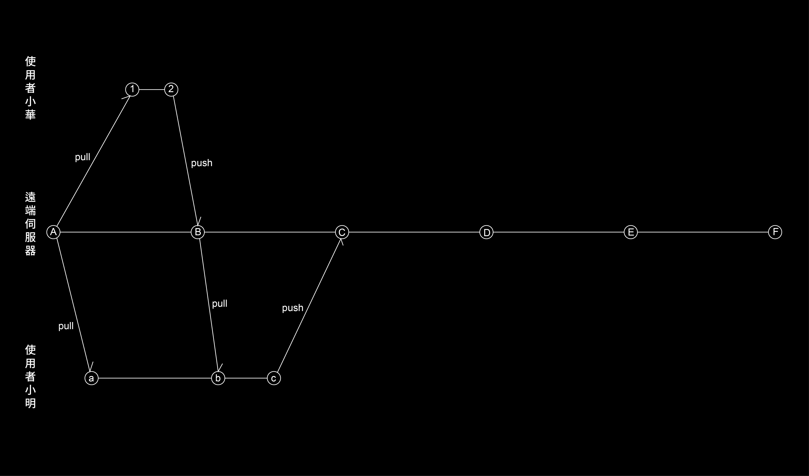

# Git的基礎運作二
這裡介紹關於Git的基礎操作原理，以及遇到最基礎的衝突時之解決辦法。  
**粗體藍字** 將會顯示 SourceTree 的操作按鈕或欄位。  
***斜體紫字*** 將會顯示 git 的命令。  
**粗體紅字** 將會顯示特有名詞。  

---
  
## Pull、Fetch、Merge
上個章節時，我們將 L- **Repo** ***push*** 到 R- **Repo** ，
而其他使用者也會 ***push*** 到 R 上，那這時我們需要將 R 回傳到 L 上。  
通常我們會有兩個方法來取得 R- **Repo** ，會先講常用的。  
  
### Pull
我們可以透過 ***pull***(拉取) 來將 R 下載到 L 並合併到。
 ***pull*** 會對比 R 和 L 間檔案的差異性，並將 L 沒有的下載下來，並 ***merge*** 到 L 的分支內，就如同圖上所示。  
 
 當有可以進行 ***pull*** 的資料時，我們可以透過按下上方列表的 **Pull** 按鈕。
  
按下之後，直接維持預設按下 **Pull** ，稍等片刻就可以完成動作。
  
基本上， ***pull*** 的操作相對接下來要介紹的簡單許多。  
  
### Fetch、Merge
  
從上圖就可以大致了解 ***pull*** 和  ***fetch***(擷取) 的區別：
*  ***pull*** : 比較差異，將沒有的下載下來，並做合併。  
*  ***fetch*** : 比較差異，將沒有的下載下來，但不做合併。  

我們開始說明關於 ***fetch*** 的部分吧！  
首先， R 的時間線已經到了 0.1.i.12.3 。  
  
而在 L 的時間線則還在 0.1.i.12 。
  
而我們可以透過 **Fetch** 來查看 R 的時間線，開啟視窗後直接按下  **OK** 。
  
這時，你會發現最上端出現了 origin/develop ，我們可以透過先查看 R 的內容來決定是否要進行合併。在 0.1.i.12.3 這個時間線上，
只有 README.md 的檔案異動。
  
  
而這時如果我們確定要將這個資料併到我們 L 的資料，
我們就可以透過  ***merge***(合併) 將該資料加到我們的資料夾內。  
我們按下上方列的 **Merge** 按鈕，開啟視窗後，
點選我們要 ***merge*** 的時間線，也就是 0.1.i.12.3 ，之後按下 **OK** 。  
  
稍帶片刻後，就會發現 L 和 R 的 **Repo** 分支同步在相同的時間線了！
  
  
### 所以他們差在哪裡?
我們了解玩它們後，再次看這個圖吧！
  
 ***pull*** 總結來說是 ***fetch*** 後做 ***merge*** 。  
   
那 ***fetch*** 的功用到底是什麼呢？  因為 ***pull*** 會自動合併，所以雖然它很方便，但沒辦法事先查看。
而 ***fetch*** 則可以讓我們先看到目標時間線的資訊，再行合併，且這也是相對安全的作法。但基本上，我們使用 ***pull*** 即可。  
  
## 從最基礎的案例認識Conflict
我來說個情境：  
> 小明和小華正在一同開發一個項目，而他們先後都在遠端儲存庫取得了A時間線的資料。  
> 而小華動作比較快，他在做完他做的事情後就推送到遠端了。  
> 雖然小明略慢了一點，但他也在之後完成了工作。  
> 但當他要推送時，卻發現了無法推送。  
> 究竟發生了甚麼問題呢？  
  
首先，我們先透過圖片來看上述情境的實際狀態：  
  
發現到問題點了嗎？  
是的，在小明要  ***push*** 時，
 R- **Repo** 實際的時間線已經是B了，
換句話說， R 的資料已經有小華 ***push*** 的資料了，
如果這時小明要 ***push*** 時，就會發生 **Coflict**(衝突)。  
  
反應迅速的可能已經知道解答了！  
既然是因為缺少 B 的資料，那就將該資料先 ***pull*** 下來，之後再重新 ***push*** 一次就可以了！  
  
  
---
[上一章節](GIT-基礎運作一.md)  
[下一章節(尚未完成)](GIT-基礎運作二.md)  
[回目錄](../README.md)  